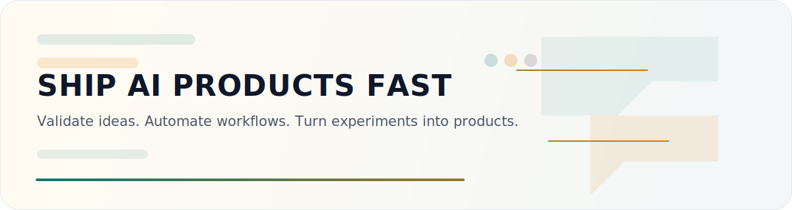
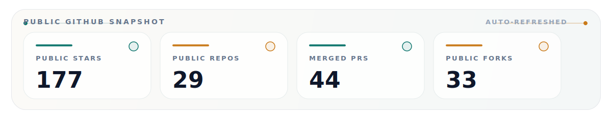

  

  AI-native products / agent systems / automation workflows

  

  <a href="https://github.com/huanghfzhufeng/SoftRight-AI"><strong>SoftRight-AI</strong></a> /
  <a href="https://github.com/huanghfzhufeng/GEO-Insight"><strong>GEO-Insight</strong></a> /
  <a href="https://github.com/huanghfzhufeng/App-Mockup-Studio"><strong>App-Mockup-Studio</strong></a> /
  <a href="https://github.com/huanghfzhufeng/csccc"><strong>csccc</strong></a>

  

  <a href="https://github.com/huanghfzhufeng?tab=repositories">All repositories</a>

